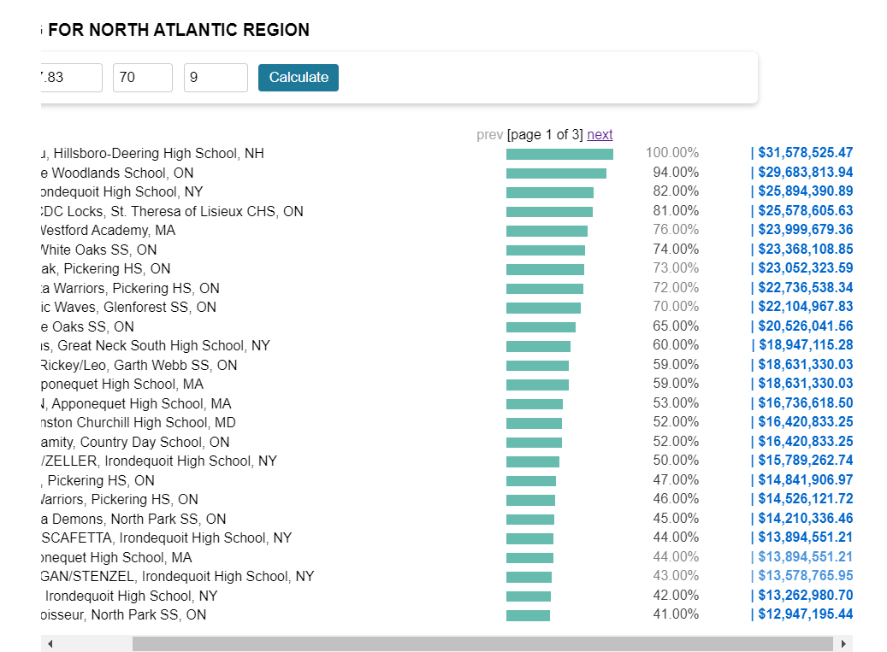

# DECA VBC Profit Calculator

> Calculate and visualize profits for teams in DECA VBC standings.

## Forked from

This project is a fork of the original! [DECA VBC Extension](https://github.com/HarryXu497/deca-vbc-extension) by [HarryXu497](https://github.com/HarryXu497). 

## Features

- Display percentages relative to the top team
- Calculate estimated profits for all teams
- Interactive UI for easy input and calculation

## Installation

### Chrome

1. Download the extension files.
2. Navigate to `chrome://extensions`.
3. Enable "Developer mode."
4. Click "Load unpacked" and select the downloaded folder.

## Demo

Click to view screenshots

## Usage

1. Navigate to the DECA VBC standings page.
2. Enter your team's total profit, percentage, and rank.
3. Click "Calculate" to see estimated profits for all teams.

## Tips

- Hover over profit values for more details.
- Click on a profit value to see it in words.
